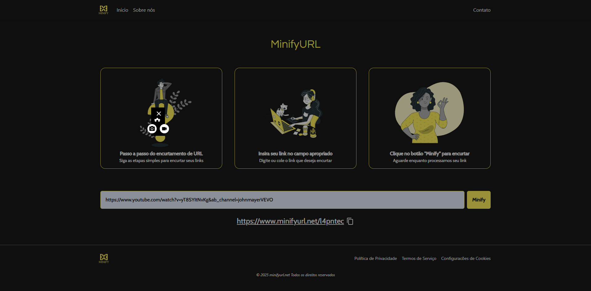

<h1 align='center'>Humilhador de Signos</h1>

<h1 align="center">
  
</h1>

## About 🚀
Minify URL - Frontend
A simple and clean frontend for a URL shortening service. Built with React and TypeScript, this project allows users to easily generate shortened URLs and manage them with a responsive and intuitive interface.
## Techs ✔

- [Next JS](https://nextjs.org/)
- [TailwindCSS](https://tailwindcss.com/)

## [Live mode](https://minifyurl.net/) 🔗

## How to install 💻

```bash
#First clone this project on your preference path

$ git clone https://github.com/Luan4560/minify-url-client

# Then got to you path, open the project and install the dependecies.

$ yarn or npm install

# After that, just initilialize the project with:

$ yarn dev
```